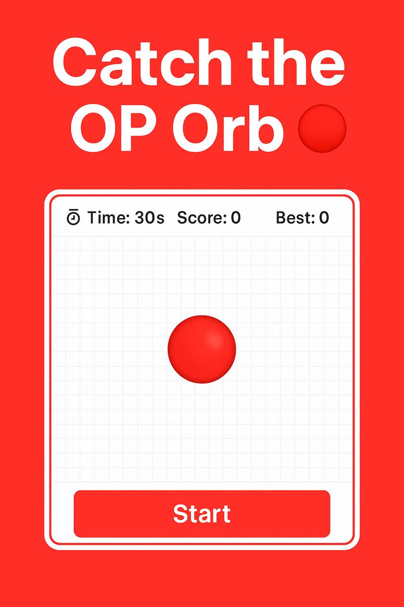

# Optimism Mini-Game — Catch the OP Orb 🎮
📌 **This project is part of the BuildForGood ecosystem — a multi-project public goods initiative for Optimism**.  

A small interactive public good built for [Optimism](https://optimism.io).  
Click the moving OP-orb to score points. You have **30 seconds**.  
Can you beat your best score?

---

## 🚀 Features
- ⏱ Timer (30 seconds)  
- ⭐ Score counter  
- 🔥 Best score (saved in local storage)  
- 🎇 Sparkle effects on clicks  
- 🎯 OP-style design (red orb, minimal UI)  
- 🔗 **Explore My Meme NFTs** button (links to [Optimism Meme Collection](https://opensea.io/collection/optimism-meme-collection))  

---

## 🌍 Live Demo
👉 [Play on GitHub Pages]( https://stephanschwab.github.io/catch-the-op-orb/)  
*(enable Pages in repo settings after uploading)*

---

## 🧩 Part of a Bigger Ecosystem
This game is part of my **RetroPGF public goods contribution**:  
- 📕 *Build For Good: The Optimism Way* (illustrated book in 10 languages)  
- 🃏 *OP Cards* NFT Collection  
- 🖼️ *Optimism Meme Collection*  
- 🗳️ Solo Builder DAO on Optimism  
- 🎶 Optimism Hymn (karaoke-style page)  
- 🎨 Comics & Coloring NFTs  
- 🎮 Mini-Games like this one  

---

## ⚖️ License
[MIT License](LICENSE)

## 🌍 BuildForGood Ecosystem  
**This project is part of the BuildForGood Ecosystem for Optimism**.  

📖 Books & Articles • 🕹 Games • 🖼 NFTs & Memes • 🌍 Onchain Artifacts • 🎥 Media  

🔗 Explore the full ecosystem: [BuildForGood Ecosystem on Optimism Atlas](https://atlas.optimism.io/0xd349d01ca7247e321116767150902eb478c8d9d7b86b51cb9abc81c579fe39d5)
---
